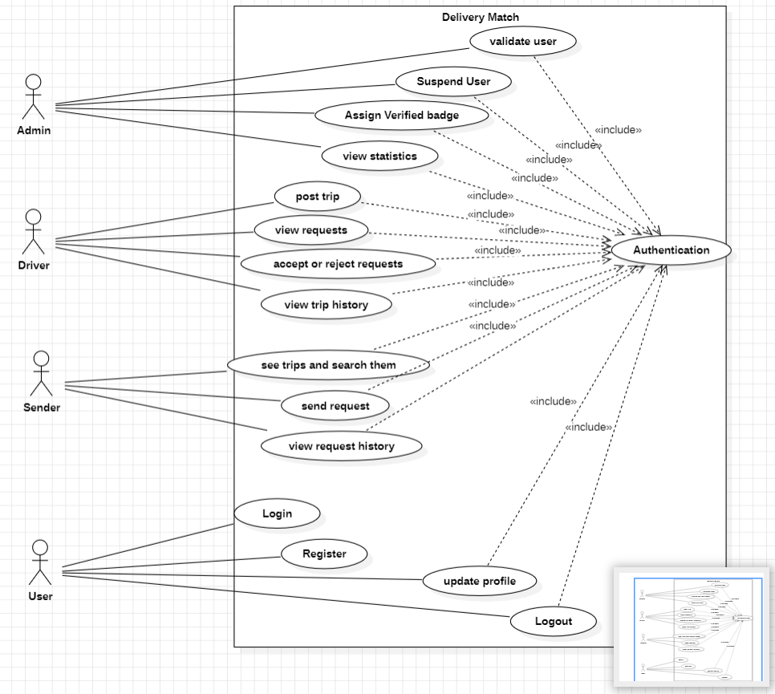
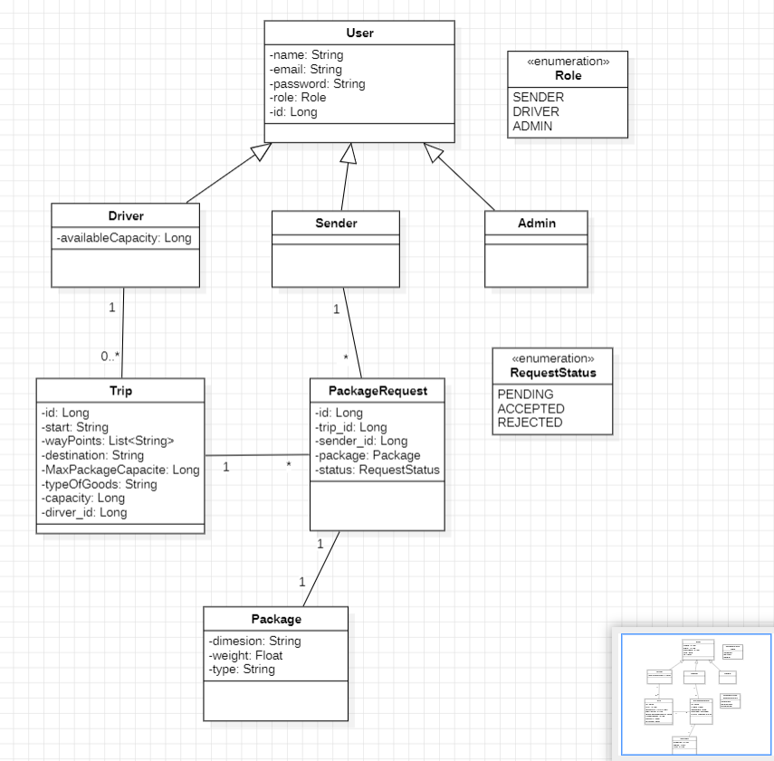
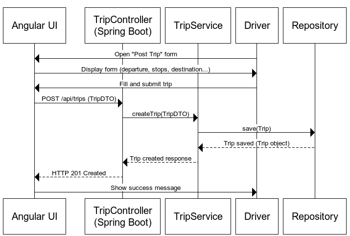

# DeliveryMatch - Collaborative Co-Transport Platform

DeliveryMatch is a full-stack web application that connects drivers with package senders, promoting a collaborative and eco-friendly delivery system. It helps users optimize transportation costs and reduce environmental impact by sharing available vehicle space.

---


##  Features

### User
- Register/Login/Logout securely
- Update personal information

### Driver
- Post a trip (departure, destination, stops, cargo type)
- View and accept/reject delivery requests
- See delivery history

### Sender
- Search and filter available trips
- Submit a delivery request with package info
- Track sent packages and history

###  Administrator
- Manage users (suspend/verify)
- Moderate posted trips
- View platform statistics with Chart.js


---

## Technologies

### Backend
- `Spring Boot`
- `Spring Data JPA`
- `Spring Security`
- `JUnit` for testing

### Frontend
- `Angular 19`
- `Angular Material`, `Bootstrap`
- `Chart.js` for stats

### Other
- `Docker` for containerization
-  `MySQL` for Database
- `Postman` for API docs

---

##  Installation

```bash
# Clone the repository
git clone https://github.com/majdeddine-oumanni/Delivery-Match.git
cd Delivery-Match

# Backend
cd backend
./mvnw spring-boot:run

# Frontend
cd frontend
npm install
ng serve
```
## Use Case Diagram
 **_Describes how users interact with the system_**
 
---
### Class Diagram
 **_Illustrates system entities and their relationships._**
 
---
### Sequence Diagram - Post Trip
 **_Shows step-by-step interaction to post a trip._**
 
---


